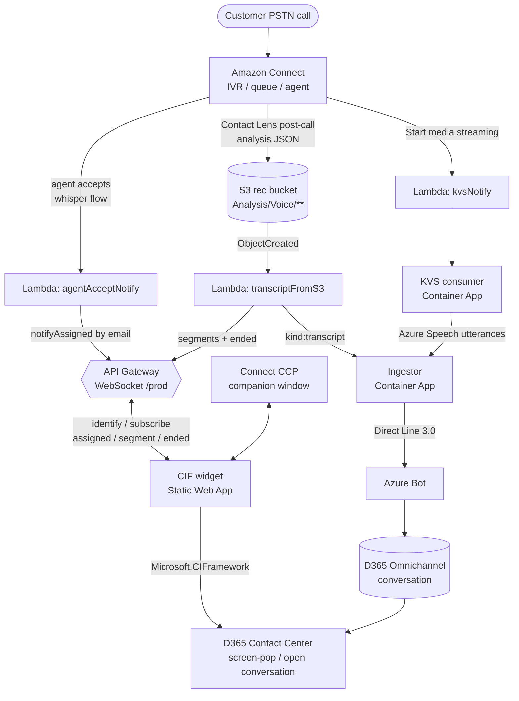

# Amazon Connect ↔ Dynamics 365 Contact Center (CIFv2)

A channel-provider integration that surfaces **Amazon Connect** voice calls inside
the **Dynamics 365 Contact Center / Customer Service** agent workspace, and streams
the call **transcript into a native D365 Omnichannel conversation** so the built-in
Copilot agents (Conversation Summary, Intent, Case Management) run on it — **without
requiring the audio to flow through D365**.

> **The call stays in Amazon Connect.** PSTN, IVR, queueing, routing and the agent
> voice path all remain in Connect. D365 receives: a **screen-pop**, an embedded
> **softphone (CCP)**, and a **transcript** materialised as an Omnichannel
> (messaging-type) conversation that the transcript-driven Copilot agents act on.

---

## TL;DR — what actually happens on a call

1. A customer calls the Connect toll-free number; Connect handles IVR/queue/routing.
2. When an agent **accepts**, a Connect *agent-whisper* flow fires a Lambda that
   pushes an `assigned` signal — over a WebSocket — to **that specific agent's**
   D365 CIF widget (correlated by SSO **email**, not a mapping table).
3. The widget subscribes its live panel to the call and (optionally) shows live
   audio-derived transcript from the KVS consumer.
4. When the call ends, Amazon **Contact Lens post-call analysis** drops a complete
   transcript JSON into S3. An S3-triggered Lambda reads it and posts the whole
   transcript to the **ingestor**, which opens **one Direct Line / Omnichannel
   conversation** containing the full transcript and closes it. The native D365
   Copilot agents (Summary, Intent, Case Management) then run on that conversation.
5. The widget receives `ended` and opens the freshly-created D365 conversation on
   the agent's screen.

For the full picture see **[docs/architecture.md](docs/architecture.md)**.

---

## Why this design

The obvious approach — embed the Connect CCP directly and stream Contact Lens
*real-time* segments — hit two hard blockers on the target instance:

| Blocker | Consequence | What we did instead |
|---|---|---|
| Connect CCP / streams cannot be **iframed** into D365 (`frame-ancestors` CSP set by AWS; a support case is open) | Can't embed the softphone the normal way | Launch the CCP in a **companion browser window** (`src/connect/ccp.ts`); the widget talks to it, not an embedded frame |
| `ListRealtimeContactAnalysisSegments` returns **404 for the whole call** on this instance (real-time Contact Lens not emitting) | The real-time poller yields no transcript | Use the **post-call Contact Lens analysis JSON in S3** as the reliable transcript source; the poller/lifecycle path is effectively a no-op |
| No maintained **Connect→D365 identity map**, and agents move between queues (won't scale to 40k agents) | Server can't reliably decide *which* D365 session to route a contact to | Route by **SSO email**: the browser session *is* the agent identity (declared via `identify`), and Connect's agent email == D365 email (same IdP) |

These decisions are documented in detail in
**[docs/architecture.md → Design decisions](docs/architecture.md#design-decisions)**.

---

## Architecture at a glance



Four independent data-flow paths make this work:

1. **Post-call transcript (primary, reliable)** — S3 → `transcriptFromS3` → ingestor → Omnichannel.
2. **Live audio transcript (optional)** — Connect media streaming → KVS → `kvs-consumer` → Azure Speech → ingestor.
3. **Agent-accept signal** — Connect whisper flow → `agentAcceptNotify` → WebSocket `assigned` to the agent's widget.
4. **Widget / screen-pop** — CIF widget subscribes by email, pops records on ANI, opens the conversation on `ended`.

---

## Repository layout

| Path | What it is | Runtime |
|---|---|---|
| `src/` | CIF channel-provider widget (the app embedded in D365) | Vite + React + TypeScript → Azure Static Web Apps |
| `aws-bridge/` | AWS Lambdas + API Gateway WebSocket + DynamoDB registry | Node 20 Lambda (SAM template is reference-only) |
| `ingestor/` | Transcript ingestor → Direct Line 3.0 → Omnichannel | Node/Express → Azure Container App |
| `kvs-consumer/` | Live KVS audio → Azure Speech → ingestor | Node/Express → Azure Container App |
| `webresources/` | D365 web resources (softphone iframe host + side-pane launcher) | Dataverse web resources |
| `deploy-webresources.ps1`, `update-webresources.ps1`, `tools/dv.ps1` | Dataverse deploy / query helpers | PowerShell + `az` token |
| `aws-bridge/deploy/` | Connect flow JSON, IAM policies, GSI spec, test events | deploy artifacts |
| `docs/` | Full documentation (see below) | — |

A per-file component inventory is in **[docs/components.md](docs/components.md)**.

---

## Documentation

| Doc | Contents |
|---|---|
| **[docs/architecture.md](docs/architecture.md)** | End-to-end architecture, the four data-flow paths, sequence diagrams, and every design decision + constraint. |
| **[docs/components.md](docs/components.md)** | Per-module inventory of `src/`, `aws-bridge/`, `ingestor/`, `kvs-consumer/`, `webresources/`. |
| **[docs/deployment.md](docs/deployment.md)** | Step-by-step deploy playbook for every component (widget, Lambdas, container apps, Connect flows, D365 CIF provider, Azure Bot). |
| **[docs/api-reference.md](docs/api-reference.md)** | WebSocket protocol, ingestor HTTP contract, KVS-consumer session API, Connect Lambda event shapes, all environment variables. |
| **[docs/deployed-resources.md](docs/deployed-resources.md)** | The live resource inventory (AWS + Azure + D365 IDs) as currently deployed. |
| **[docs/troubleshooting.md](docs/troubleshooting.md)** | Symptoms → causes → fixes, including the `frame-ancestors` and real-time Contact Lens 404 issues. |
| **[docs/original-design-notes.md](docs/original-design-notes.md)** | The earlier (poller-based) design, kept for history. |

---

## Build & run

```bash
# Widget (CIF provider)
npm install
npm run dev            # local dev on https://localhost:5173 (D365 requires HTTPS)
npm run build          # -> dist/  (deploy to Azure Static Web Apps)

# AWS bridge Lambdas
cd aws-bridge && npm install && npm run build

# Ingestor
cd ingestor && npm install && npm run build && docker build -t ingestor .

# KVS consumer
cd kvs-consumer && npm install && npm run build && docker build -t kvs-consumer .
```

Configuration is entirely via environment variables — **no secrets live in the
repo**. See **[docs/api-reference.md → Environment variables](docs/api-reference.md#environment-variables)**
for the full list per component, and **[docs/deployment.md](docs/deployment.md)**
for where each value comes from.

> **Security note:** `synth-test.ps1` and all sample scripts read secrets from
> environment variables (`$env:INGESTOR_KEY`, etc.). Real Direct Line secrets,
> ingestor/session keys and bot passwords are kept in gitignored `.env.local` /
> `.secrets.*` files and are **never** committed.

---

## Status (deployed)

- [x] CIF widget deployed to Azure Static Web Apps, registered as a D365 CIF provider.
- [x] AWS bridge deployed: WebSocket API, DynamoDB registry (`byContact` + `byAgent` GSIs), `transcriptFromS3`, `agentAcceptNotify`, `kvsNotify`, `websocket` Lambdas.
- [x] Ingestor + KVS consumer deployed as Azure Container Apps.
- [x] Azure Bot + Direct Line 3.0 provisioned; Omnichannel custom messaging channel wired.
- [x] Connect agent-whisper flow + media-streaming flow wired; S3 post-call analysis notification enabled.
- [x] D365 web resources deployed (softphone host + side-pane launcher).

See **[docs/deployed-resources.md](docs/deployed-resources.md)** for the exact
resource IDs, and the **[GitHub Release](../../releases)** for the packaged
deployment artifacts (Lambda bundles, built widget, IAM policies, GSI spec).
