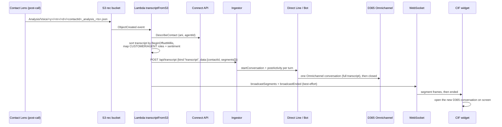
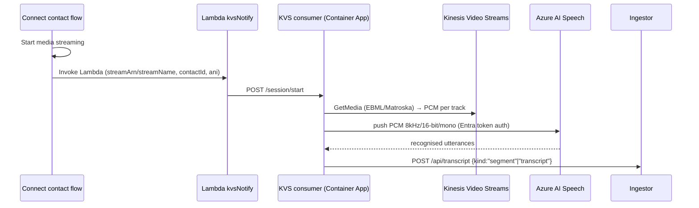
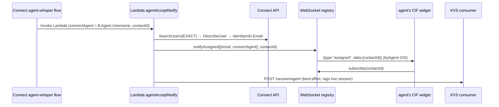

# Architecture

This document describes the full architecture of the Amazon Connect ↔ Dynamics 365
Contact Center integration as it is **currently deployed**.

## Goals & constraints

- **Keep the call in Amazon Connect.** PSTN, IVR, queueing, routing and the agent
  voice path stay in Connect. D365 is an *assistive surface*, not the telephony
  platform.
- **Light up native D365 Copilot agents** (Conversation Summary, Intent, Case
  Management) — which are **transcript-driven**, not audio-driven — by creating a
  real Omnichannel conversation whose messages are the call transcript.
- **No maintained identity map** between Connect and D365, and **no dependency on
  which queue an agent is in**. This has to scale to tens of thousands of agents.

## The core idea: route by SSO email

The single most important design choice: **the browser session is the agent
identity**. When the CIF widget loads inside D365, it resolves the signed-in
agent's email (`systemuser.internalemailaddress`) and declares it to the bridge
via an `identify` WebSocket message. Because Amazon Connect and D365 share the
same identity provider, the agent's **Connect email == D365 email**. So when
Connect signals that a contact was accepted by a given agent, the bridge can push
an `assigned` frame to exactly that agent's widget — **without any lookup table**.

```
Connect agent (email)  ──accept──►  bridge  ──push 'assigned'──►  D365 widget (same email)
```

This is queue-agnostic and scale-free. The DynamoDB registry has a `byAgent` GSI
keyed on the normalised (lower-cased, trimmed) email, so the push is an O(1)
query.

## The four data-flow paths

The integration is not one pipeline — it is four independent paths that each own
one concern. They can fail independently without taking down the others.

### 1. Post-call transcript (primary, reliable)

This is the path that guarantees a conversation always gets created with a
complete transcript.



Key properties:

- **One atomic post** (`kind:"transcript"`) → **one** Omnichannel conversation with
  the whole transcript, then closed. That is exactly what the native Copilot
  agents need to run.
- The `contactId` is read from `CustomerMetadata.ContactId`, falling back to the
  filename (`<contactId>_analysis_...`).
- `DescribeContact` enriches with the caller ANI and the accepting agent id.
- Widget push (`broadcastSegments`/`broadcastEnded`) is **best-effort** — a UI
  push failure never fails the ingest.

Handler: [`aws-bridge/src/transcriptFromS3.ts`](../aws-bridge/src/transcriptFromS3.ts).

> Why post-call and not real-time? On the target instance,
> `ListRealtimeContactAnalysisSegments` returns **404 for the entire call** — the
> real-time Contact Lens stream never yields segments. Post-call analysis always
> lands in S3 a minute or two after the call. So the reliable transcript source is
> S3, and the real-time poller (`poller.ts`) / lifecycle (`lifecycle.ts`) path is
> effectively a no-op kept only for reference.

### 2. Live audio transcript (optional, real-time)

For live in-call transcript (before the post-call analysis exists), the call audio
is streamed from Connect via Kinesis Video Streams and transcribed with Azure AI
Speech.



Notes:

- Azure Speech uses **Microsoft Entra (managed identity) token auth**
  (`aad#{resourceId}#{token}`) because the org policy sets
  `disableLocalAuth=true` on the Speech account. A raw key is only a fallback.
- Audio is PCM **8 kHz / 16-bit / mono per track** (Connect KVS format).
- The accepting agent is pinned onto the live session via `POST /session/agent`
  (see path 3), so the live conversation is created on the right agent.

Handlers: [`aws-bridge/src/kvsNotify.ts`](../aws-bridge/src/kvsNotify.ts),
[`kvs-consumer/src/`](../kvs-consumer/src/).

### 3. Agent-accept signal

The definitive, synchronous "this agent accepted this contact" signal.



- The whisper flow runs **in the accepting agent's context**, so `$.Agent.Username`
  is the definitive accepting agent.
- `resolveAgentEmail` maps the Connect username → SSO email via
  `SearchUsers` (exact) then `DescribeUser` `IdentityInfo.Email`, with an
  in-process cache.
- `notifyAssigned` tries **both** the resolved email and the raw username as
  candidates (covers SAML federation where the username *is* the email).

Handlers: [`aws-bridge/src/agentAcceptNotify.ts`](../aws-bridge/src/agentAcceptNotify.ts),
[`aws-bridge/src/agentEmail.ts`](../aws-bridge/src/agentEmail.ts).

### 4. Widget / screen-pop

The CIF widget is the piece embedded inside D365.

- **On mount:** resolves the agent email (`getCurrentUserEmail()` →
  `systemuser.internalemailaddress`) and calls `identify(email)`.
- **On `assigned(contactId)`:** `subscribe(contactId)` to receive live segments,
  and screen-pop on the caller ANI (`screenPopByPhone`).
- **On `ended(contactId)`:** open the freshly-created Omnichannel conversation on
  the agent's screen (`openConversationByContactIdWithRetry`, up to 6 attempts,
  5 s apart, to absorb the ingest→conversation creation lag).
- **Softphone:** the Connect CCP is launched in a **companion window**
  (`openSoftphone()`), not an iframe, because the CCP sets a `frame-ancestors`
  CSP that blocks embedding in D365.

Handlers: [`src/App.tsx`](../src/App.tsx),
[`src/cif/ciframework.ts`](../src/cif/ciframework.ts),
[`src/connect/ccp.ts`](../src/connect/ccp.ts),
[`src/bridge/transcript.ts`](../src/bridge/transcript.ts).

## The WebSocket registry

A single DynamoDB table (`ConnectionsTable`) holds one row per live widget
connection, with two lookup keys and two GSIs:

| Attribute | Set by | Used for |
|---|---|---|
| `connectionId` (HASH) | `$connect` | primary key; cleaned up on `$disconnect` / 410 |
| `agentEmail` | `identify` (normalised) | `byAgent` GSI → push `assigned` to a specific agent |
| `contactId` | `subscribe` | `byContact` GSI → push `segment` / `ended` for a call |
| `ttl` | `$connect` | auto-expiry after 4 hours |

Server → client frames: `{ type: "segment" | "suggestion" | "assigned" | "ended", data }`.
Client → server actions: `identify { agentUpn }`, `subscribe { contactId }`, `unsubscribe`.

The client auto-reconnects after 2 s and **re-declares identity + re-subscribes**
on reconnect (`src/bridge/transcript.ts`).

Full protocol in **[api-reference.md](api-reference.md)**.

## Ingestion transport: Direct Line 3.0

The ingestor opens **one Direct Line conversation per Connect `contactId`** and
posts each transcript turn as an activity. The Azure Bot's messaging endpoint is
the Omnichannel inbound URL, so those activities land in a native D365 Omnichannel
conversation that the Copilot agents run on. This is the documented "bring your own
channel" (custom messaging) model. The client retries on 429/5xx and refreshes the
Direct Line token as needed ([`ingestor/src/omnichannel.ts`](../ingestor/src/omnichannel.ts)).

## Design decisions

| # | Decision | Rationale |
|---|---|---|
| D1 | **Companion-window CCP** instead of embedded iframe | The Connect CCP sets a `frame-ancestors` CSP that blocks embedding in `*.dynamics.com`. An AWS support case is open; the companion window is the working path today. `src/connect/streams.ts` was deleted for the same reason. |
| D2 | **Post-call S3 transcript** as the source of truth | `ListRealtimeContactAnalysisSegments` 404s for the whole call on this instance; post-call Contact Lens analysis JSON is always written to S3 and is complete. |
| D3 | **Route by SSO email**, not a mapping table | No maintained Connect→D365 map; agents move between queues; must scale to ~40k agents. The browser session *is* the identity. |
| D4 | **One atomic `kind:"transcript"` post** per call | Produces exactly one Omnichannel conversation with the full transcript, which is what the native Copilot agents consume. |
| D5 | **Agent-whisper flow** for the accept signal | Runs in the accepting agent's context, giving the definitive `$.Agent.Username` at the exact accept moment. |
| D6 | **Entra token auth for Azure Speech** | Org policy sets `disableLocalAuth=true`; managed-identity token (`aad#{resourceId}#{token}`) is required. |
| D7 | **Container Apps (not Functions) for ingestor/consumer** | The subscription enforces `publicNetworkAccess=Disabled` on storage; Functions Consumption needs a public `AzureWebJobsStorage`. Container Apps have no such dependency. |
| D8 | **Messaging-type Omnichannel conversation** | Transcript-driven Copilot agents (Summary/Intent/Case) don't need a native voice conversation. Note: **Intent** is separately gated by the Service Copilot (Customer Service Enterprise) license per agent. |

See **[troubleshooting.md](troubleshooting.md)** for the operational symptoms
behind D1–D2 and how to verify them.
